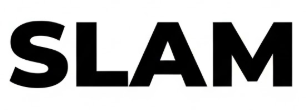

  

<h3 align="center" style="color:#00FFFF; margin-top:0;">
  Robotics Engineer | Patent Holder | Autonomous Systems Architect
</h3>

---

##  About Me

 **Location:** Navi Mumbai, India  
 **Education:** Final Year B.Tech in *Electronics & Telecommunication Specialization in Robotics* – RAIT  
 **CGPA:** 9.09 / 10  
 **Email:** [kshitizsaxena2611@gmail.com](mailto:kshitizsaxena2611@gmail.com)  

Bringing imagination to life — passionate about creating intelligent robotic systems that move from concept to reality.

Skilled in **ROS, Computer Vision, Embedded Systems, PCB Design, and 3D Modeling**. Fueled by an insatiable hunger to tackle complex problems and engineer solutions that work beyond the screen.

Where algorithms meet hardware, and ideas become autonomous machines.

---

##  Current Work

---

##  Tech Arsenal

###  Languages

  
  
  
  
  
  

### Embedded Frameworks

 
  
  
  
  

 
  
  
  

### Libraries

  
  
  
  
  
  
  
  
  

###  MLOps & Tools

  
  
  
  
  
  

###  Databases & Backend

  
  
  
  
  
  

###  Data & Visualization

  
  
  
  
  
  

---

##  Featured Projects

**<a href="https://github.com/Ojas1584/Clinical_Decision_Support_RAG">Clinical Decision Support System (RAG)</a>**  
- RAG pipeline sourcing NCCN & ICMR guidelines, improving relevance by 40%.  
- Processed 500+ complex PDFs into Weaviate vector DB via Python + Marker.  
- Benchmarked Llama 3.1, Mistral; selected **Llama 3.1** for best reasoning & faithfulness.  
**Stack:** Python · LangChain · Weaviate · Llama 3.1 · NLP  

**<a href="https://github.com/Ojas1584/ArucoMarkerDetectionDrone">Marker-Based UAV Navigation (Patent Filed)</a>**  
- Robust indoor autonomy using ArUco markers.  
- Custom ID-based logic boosted detection accuracy by 30%.  
- Adaptive motion planning reduced path error by 40%.  
**Stack:** Python · OpenCV · ROS · Computer Vision  

**<a href="https://github.com/Ojas1584/Leaf-Disease-Detection-YOLOv8-">Leaf Disease Detection (YOLOv8)</a>**  
- 97% accuracy in classifying plant diseases.  
- 25% robustness improvement under variable lighting via augmentation.  
**Stack:** Python · YOLOv8 · Deep Learning  

**<a href="https://github.com/Ojas1584/A_star_PathPlanningAlgorithm_Drone">A Star Path Planning for Drones</a>**  
- Optimized A* in ROS/Gazebo; 95% obstacle avoidance.  
- Reduced mission time by 15% through re-planning.  
**Stack:** Python · ROS · Gazebo  

---

##  Connect With Me

  
  
  

## Fun Fact
<blockquote align="center">
  <h3 style="color:#00C6FF;">“Building tomorrow's intelligent machines, today.”</h3>
</blockquote>

---

  

  
   
  <i>Last Updated: December 2025</i>

